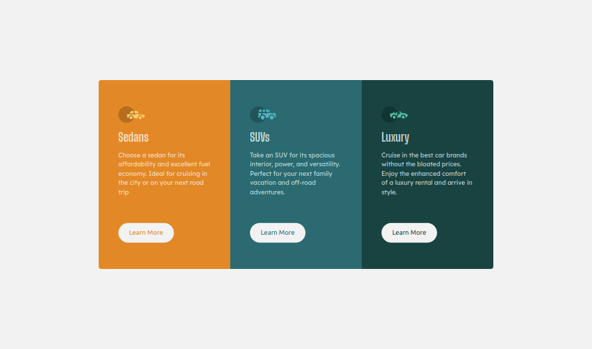

# Frontend Mentor - 3-column preview card component solution

This is a solution to the [3-column preview card component challenge on Frontend Mentor](https://www.frontendmentor.io/challenges/3column-preview-card-component-pH92eAR2-).

## Table of contents

- [Overview](#overview)
  - [The challenge](#the-challenge)
  - [Screenshot](#screenshot)
  - [Links](#links)
- [My process](#my-process)
  - [Built with](#built-with)
  - [Author](#author)

## Overview

### The challenge

Users should be able to:

- View the optimal layout depending on their device's screen size
- See hover states for interactive elements

### Screenshot

### Links

- Live Site URL: [https://hasnainahmad04.github.io/3-column-preview/](https://hasnainahmad04.github.io/3-column-preview/)
- Solution URL: [https://www.frontendmentor.io/solutions/frontend-mentor-3column-preview-card-component-solution-eWTKINOtPL](https://www.frontendmentor.io/solutions/frontend-mentor-3column-preview-card-component-solution-eWTKINOtPL)

## My process

### Built with

- Semantic HTML5 markup
- Tailwind
- Flexbox
- Mobile-first workflow

## Author

- Twitter - [@nain_2206](https://x.com/nain_2206)
- Frontend Mentor - [@Hasnainahmad04](https://www.frontendmentor.io/profile/Hasnainahmad04)
